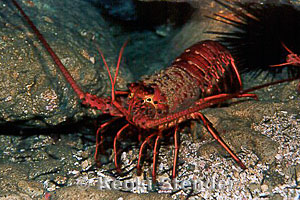

```{r setup, include=FALSE}
knitr::opts_chunk$set(echo = FALSE, warning = FALSE, message = FALSE)
```

```{r}
library(tidyverse)
library(janitor)
library(tidyr)
library(effsize)
library(kableExtra)
library(ggridges)
```

```{r}
lobster_abundance <- read.csv("lobster_abundance_sbc_lter.csv",
                              na = -99999) %>% 
  clean_names() %>% 
  mutate(site = as.character(site))

lobster_abundance$site[lobster_abundance$site == "IVEE"] <- "Isla Vista"
lobster_abundance$site[lobster_abundance$site == "NAPL"] <- "Naples"
lobster_abundance$site[lobster_abundance$site == "AQUE"] <- "Arroyo Quemado"
lobster_abundance$site[lobster_abundance$site == "CARP"] <- "Carpinteria"
lobster_abundance$site[lobster_abundance$site == "MOHK"] <- "Mohawk"
```

### 1. Introduction

The California spiny lobster (*Panulirus interruptus*) is an important species along the Southern California coast and plays a key role in maintaining diversity in kelp forests (National Park Service, 2016). These lobsters are a common target for fishermen, which greatly affects their size and abundance in the kelp forest ecosystems (National Park Service, 2016). This report explores the relationship between the abundance and size distribution of the California spiny lobster at 5 locations along the Santa Barbara channel. On January 1st, 2012, two of the 5 sites were designated as marine protected areas (MPAs) by the California Department of Fish and Wildlife (SBC LTER, 2019). Human activity, including fishing, is restricted in MPAs, and as a result many have shown positive trends of habitat recovery (Santa Barbara Channelkeeper). This report hopes to answer the question of whether MPAs affect the California spiny lobster size and abundance along the Santa Barbara coast. This will help assess the recovery of the kelp forest ecosystem.



### 2. Data and Methods

The two variables being analyzed in this report are lobster size (mm) and lobster abundance at 5 sites along the Santa Barbara channel between years 2012 and 2018. Data on abundance and size were collected annually by divers just before the start of the fishing season in late summer (SBC LTER, 2019). Lobster counts were compared at each site over the time period of 2012 to 2018. Welch’s two sample t-test and Cohen's d effect size test were used to compare lobster sizes at MPA and non-MPA sites for 2012 and 2018. The following samples were compared:

- 2012 MPA vs. 2012 Non-MPA sites
- 2018 MPA vs. 2018 Non-MPA sites
- 2012 MPA vs. 2018 MPA sites
- 2012 Non-MPA vs. 2018 Non-MPA sites

A 95% confidence level was used to determine significance. Rstudio Version 1.2.1335 was used to analyze data, create figures and tables, and run statistical tests.

### 3. Results

#### a. Results A - Lobster Abundance

```{r}
lobster_count <- lobster_abundance %>% 
  group_by(year, site) %>% 
  summarize(total_counts = sum(count)) %>% 
  mutate(Category = ifelse(site %in% c("Isla Vista", "Naples"), "MPA", "Non-MPA")) %>% 
  mutate(Site = site)
  
ggplot(lobster_count, aes(x = year, y = total_counts)) +
  geom_line(aes(color = Site, linetype = Category)) +
  theme_bw() +
  theme(legend.position = "right",
        legend.key.height = unit(6, "mm"),
        legend.key.width = unit(4, "mm"),
        plot.caption = element_text(hjust = 0),
        plot.subtitle = element_text(size = 8)) +
  scale_x_continuous(limits = c(2012, 2018),
                     expand = c(0,0)) +
  scale_y_continuous(limits = c(0, 1000),
                     expand = c(0,0)) +
  labs(x = "Year (2012-2018)",
       y = "Total lobster counts",
       title = "Spiny lobster abundance in the Santa Barbara Channel (2012-2018)",
       subtitle = "Source: SBC LTER",
       caption = "Figure 1. Counts of California spiny lobster at 5 sites in the Santa Barbara Channel between 2012 and 2018. Solid \nlines indicate the sites that are in MPAs (Isla Vista and Naples), and dashed lines are sites that are not in MPAs \n(Arroyo Quemado, Carpinteria, and Mohawk).")

```

In general, the total lobster abundances at each of the 5 survey sites have increased from 2012 to 2018. However, the only two sites to show an increase in abundance over the final year of study (2017 to 2018) are Isla Vista and Naples, both of these sites are located in MPAs. The three sites that are not in MPAs show a decrease in total lobster abundance over the final year of the survey. It appears from the trends in Figure 1 that designated MPAs help improve lobster abundance in those areas.

#### b. Results B - Lobster Size Distribution

```{r}
lobster_size <- lobster_abundance %>% 
  filter(year %in% c("2012", "2018")) %>% 
  uncount(count) %>% 
  mutate(Year = as.character(year))

ggplot(lobster_size, aes(y = Year, x = size_mm, fill = Year, color = Year)) +
  geom_density_ridges(color = "gray40",
                      alpha = 0.7) +
  facet_wrap(~site) +
  theme_bw() +
  scale_y_discrete(expand = c(0,0)) +
  theme(legend.position = c(0.84, 0.25),
        plot.caption = element_text(hjust = 0),
        plot.subtitle = element_text(size = 8)) +
  labs(y = "Year",
       x = "Lobster Size (mm)",
       title = "Spiny lobster size distribution in the Santa Barbara Channel in 2012 and 2018",
       subtitle = "Source: SBC LTER",
       caption = "Figure 2. Size distributions of California spiny lobsters at 5 survey sites in the Santa Barbara Channel, collected in \n2012 and 2018. Lobster sizes (in mm) were measured at Arroyo Quemado (n = 38 in 2012, n = 54 in 2018), \nCarpinteria (n = 78 in 2012, n = 343 in 2018), Isla Vista (n = 26 in 2012, n = 946 in 2018), Mohawk (n = 83 in 2012, \nn = 164 in 2018), and Naples (n = 6 in 2012, n = 298 in 2018). Isla Vista and Naples are in MPAs, the rest are not.")
  
```

The density plots in Figure 2 show the distribution of lobster sizes (mm) at each site in 2012 and 2018. The two MPA sites, Isla Vista and Naples, show a positive shift in lobster size distribution in 2018 compared to 2012. However, the non-MPA sites, Arroyo Quemado, Mohawk and Carpinteria, show little to no shifts in lobster size distribution. Based on trends shown in Figure 2, lobster populations are able to grow larger at MPA sites which may indicate they are healthier and living longer due to reduced fishing and a flourishing habitat.

#### c. Results C - Mean Lobster Size Comparisons

```{r}
lobster_compare <- lobster_size %>% 
  mutate(site_category = if_else(site %in% c("Naples", "Isla Vista"), "MPA", "Non-MPA")) %>% 
  select(year, site, size_mm, site_category)

lobster_summary <- lobster_compare %>% 
  group_by(year, site_category) %>% 
  summarize(
    mean_size = mean(size_mm, na.rm = TRUE),
    sd_size = sd(size_mm, na.rm = TRUE),
    lobster_number = n()) 

# summary table of lobster statistics 
##### ADD CAPTION ABOVE TABLE
lobster_summary %>% 
  kable(digits = 2,
        caption = "Table 1. Summary statistics (mean, standard deviation, and number of counts) of California spiny lobster size distributions at MPA vs. non-MPA sites in 2012 and 2018",
        col.names = c("Year",
                      "MPA or Non-MPA",
                      "Mean Size (mm)",
                      "Standard Deviation (mm)",
                      "Count")) %>% 
  kable_styling(bootstrap_options = "bordered",
                full_width = FALSE,
                position = "left")

#### start performing two-sample t-tests for 2012 MPA vs. non-MPA, 2018 MPA vs. non-MPA, 2012 MPA vs 2018 MPA, 2012 non-MPA vs 2018 non-MPA

# Create vectors 
lobster2012mpa <- lobster_compare %>% 
  filter(year == "2012") %>% 
  filter(site_category == "MPA") %>% 
  pull(size_mm)

lobster2012nonmpa <- lobster_compare %>% 
  filter(year == "2012") %>% 
  filter(site_category == "Non-MPA") %>% 
  pull(size_mm)

lobster2018mpa <- lobster_compare %>% 
  filter(year == "2018") %>% 
  filter(site_category == "MPA") %>% 
  pull(size_mm)

lobster2018nonmpa <- lobster_compare %>% 
  filter(year == "2018") %>% 
  filter(site_category == "Non-MPA") %>% 
  pull(size_mm)

# t-test and cohen's d comparing mpa and non-mpa sites in 2012
lobster2012_ttest <- t.test(lobster2012mpa, lobster2012nonmpa)

lobster2012_d <- cohen.d(lobster2012mpa, lobster2012nonmpa)

# t-test and cohen's d comparing mpa and non-mpa sites in 2018
lobster2018_ttest <- t.test(lobster2018mpa, lobster2018nonmpa)

lobster2018_d <- cohen.d(lobster2018mpa, lobster2018nonmpa)

# t-test comparing mpa sites in 2012 and 2018
lobster_mpa_ttest <- t.test(lobster2012mpa, lobster2018mpa)

lobster_mpa_d <- cohen.d(lobster2012mpa, lobster2018mpa)

# t-test comparing non-mpa sites in 2012 and 2018
lobster_nonmpa_ttest <- t.test(lobster2012nonmpa, lobster2018nonmpa)

lobster_nonmpa_d <- cohen.d(lobster2012nonmpa, lobster2018nonmpa)

```
Comparing the results for mean lobster sizes at MPA and non-MPA sites in 2012 and 2018 provides insight into the recovery of kelp forest ecosystems in the Santa Barbara Channel. The results of the statistical summary of lobster size samples are listed in Table 1. The most striking result is that the mean lobster size in MPA sites increased from `r round(lobster_mpa_ttest$estimate[1], 2)` mm (n = 32) to `r round(lobster_mpa_ttest$estimate[2], 2)` mm (n = 1244), an increase of 10.19 mm. These means were found to be significantly different (t = `r round(lobster_mpa_ttest$statistic, 2)`, p < 0.0001) with a large effect size (Cohen's d = `r round(lobster_mpa_d$estimate[1], 2)`). The result is a significant increase in mean lobster size from 2012 to 2018, which suggests that MPA designation is contributing to improved lobster health and longevity.

In constrast, the samples collected in non-MPA sites in 2012 and 2018 did not show a significant difference in mean lobster size (t = `r round(lobster_nonmpa_ttest$statistic, 2)`, p = `r round(lobster_nonmpa_ttest$p.value, 2)`). The sample means actually decreased slightly from `r round(lobster_nonmpa_ttest$estimate[1], 2)` mm (n = 199) to `r round(lobster_nonmpa_ttest$estimate[2], 2)` mm (n = 561). The effect size (Cohen's d = `r round(lobster_nonmpa_d$estimate[1], 2)`) was negligible, meaning that the sample means in 2012 and 2018 are very close to each other. The result is a lack of significant difference in mean lobster sizes in non-MPA sites between 2012 and 2018.


Looking just at the 2012 samples, Table 1 shows that the mean lobster sizes were smaller in MPA sites (`r round(lobster2012_ttest$estimate[1], 2)` mm, n = 32) than non-MPA sites (`r round(lobster2012_ttest$estimate[2], 2)` mm, n = 199). Although the difference cannot be considered significant (t = `r round(lobster2012_ttest$statistic, 2)`, p = `r round(lobster2012_ttest$p.value, 4)`), a medium effect size (Cohen's d = `r round(lobster2012_d$estimate[1], 2)`) suggests that there is somewhat of a difference in means. 

However, when comparing MPA sites to non-MPA sites in 2018, there is almost no difference in mean lobster sizes. In fact, MPA sites (`r round(lobster2018_ttest$estimate[1], 2)` mm, n = 1244) have a mean that is 3.95 mm larger than non-MPA sites (`r round(lobster2018_ttest$estimate[2], 2)` mm, n = 561). Statistical analysis shows no signifnicant difference (t = `r round(lobster2018_ttest$statistic, 2)`, p < 0.0001) between the two samples and a small effect size (Cohen's d = `r round(lobster2018_d$estimate[1], 2)`). These results suggest that mean lobster sizes in MPA sites have recovered from 2012 to 2018 to the point of surpassing non-MPA sites. 

### 4. Summary
The results from the data analysis on California spiny lobsters in the Santa Barbara Channel suggest the following conclusions:

- Between 2012 and 2018, spiny lobster abundances have increased more at MPA sites than at non-MPA sites, as seen in Figure 1.
- The distributions of lobster sizes shown in Figure 2 have shifted positively (increased in size) from 2012 to 2018 only at the two MPA sites, whereas the non-MPA sites did not show any differences in size distribution between 2012 and 2018 samples.
- As seen in Table 1, there was a significant increase in mean lobster sizes at MPA sites from 2012 to 2018. No significant difference in mean lobster sizes could be determined at non-MPA sites from 2012 to 2018. MPA sites have gone from having smaller mean lobster sizes than non-MPA sites in 2012, to slightly larger mean lobster sizes than non-MPA sites in 2018.
- The results from this statistical analysis provide evidence that MPA designations have been effective in improving California spiny lobster health and abundance in the Santa Barbara Channel, which may suggest an improvement in kelp forest ecosystem health as well.

### 5. References

[1] Reed D. 2019. *SBC LTER: Reef: Abundance, size and fishing effort for California Spiny Lobster (Panulirus interruptus), ongoing since 2012.* Environmental Data Initiative. https://doi.org/10.6073/pasta/a593a675d644fdefb736750b291579a0

[2] “California Spiny Lobster.” National Parks Service, U.S. Department of the Interior, 13 July 2016. https://www.nps.gov/chis/learn/nature/california-spiny-lobster.htm 

[3] “Learn about MPAs: Santa Barbara Channelkeeper: Keeping Watch for Clean Water.” Santa Barbara Channelkeeper. https://www.sbck.org/current-issues/marine-conservation/marine-protected-areas/learn-about-mpas/
